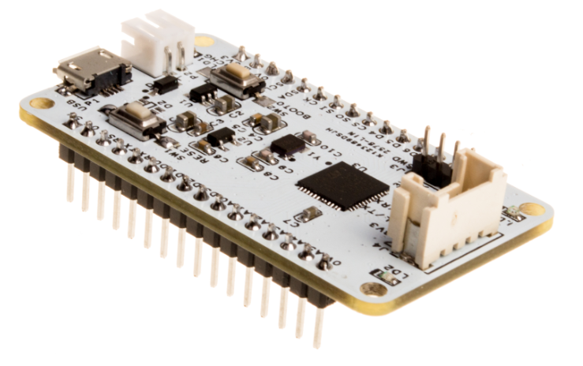
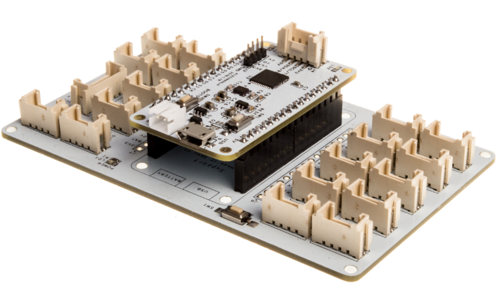
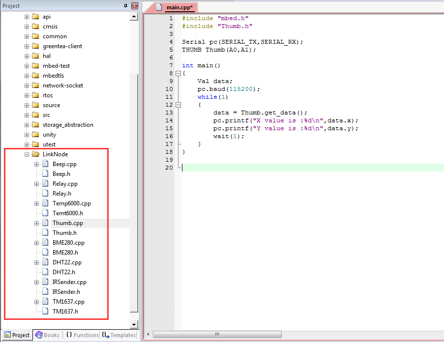

# LinkNode core STM32

## Introduction




LinkNode core STM32 is Mbed-compatible development board which is powered by the high integrated chip STM32F411CEU6.

Thanks for the Mbed OS,We use NUCLEO f411 mbed platform source code,according to our board to modify the program, so that it can run in the LinkNode Core STM32 and now supports offline compilation and download programming is fully compatible with MBED OS, At the same time, LinkNode core STM32 has Linker Base which make it very easy to connect to LinkNode Sensors.

## Features
* Powered by STM32F411CE
* 10 Digital I/O pins
* 6 Analog Input pin
* 1 micro USB port for power
* Download and debug program with Jlink SW
* Download Program with Uart1

## Pin Mapping

| LinkNode Base Pins | STM32 Pins |
| -------------|:------------:|
| A0    | PA_4      |
| A1    | PA_5      |
| A2    | PA_6      |
| A3    | PA_7      |
| A4    | PB_0      |
| A5    | PB_1      |
| D0    | PA_0      |
| D1    | PA_1      |
| D2    | PA_2      |
| D3    | PA_3      |
| D4    | PA_8      |
| D5    | PB_8      |
| D6    | PB_9      |
| D7    | PB_15     |
| D8    | PB_14     |
| D9    | PB_13     |

## Tutorials

* Download Keil uVision5 and install it
* Download LinkNode core [STM32 program]()
* Prepare USB to TTL Module or Jlink

### 1.Blink LED

* Open the program with Keil Uvision5
* Connect LinkNode core STM32 to your PC with Jlink or Uart
* Write the code as below and download it
* LinkNode Base for LinkNode LED2 will blink

```
#include "mbed.h"
DigitalInOut led(LED2);

int main() 
{
    while (true) 
    {
        led = 1;
        wait(0.5);
        led = 0;
        wait(0.5);
    }
}

```

### 2.Serial print Hello World

* Open the program with Keil Uvision5
* Connect LinkNode core STM32 to your PC with Uart
* Write the code as below and download it
* Open the PC serial port tools,set the appropriate parameters
* You will see serial print "Hello LinkNode!\n"

```
#include "mbed.h"

Serial pc(SERIAL_TX,SERIAL_RX);

int main()
{
    pc.baud(115200);
    while(1)
    {
        pc.printf("Hello LinkNode!\n");
        wait(1);
    }
}

```


### 3.LinkNode Sensor Beep
* Open the program with Keil Uvision5
* Connect LinkNode core STM32 to your PC with Jlink or Uart
* Connect LinkNode Sensor Beep to LinkNode Base
* Write the code as below and download it
* The Buzzer will beep


```
#include "mbed.h"
#include "Beep.h"

BEEP Beep(D5);

int main()
{
    int hz = 1000;
    int time_ms = 1000;
    while(1)
    {
        Beep.Start(hz,time_ms);
        wait(10);
    }
}


```

### 4.LinkNode Snesor Thumb Joystick

* Open the program with Keil Uvision5
* Connect LinkNode core STM32 to your PC with Uart
* Connect LinkNode Sensor Thumb Joystick to LinkNode Base
* Write the code as below and download it
* Open the PC serial port tools,set the appropriate parameters
* You will see serial print value

```
#include "mbed.h"
#include "Thumb.h"

Serial pc(SERIAL_TX,SERIAL_RX);
THUMB Thumb(A0,A1);

int main()
{
    Val data;
    pc.baud(115200);
    while(1)
    {
        data = Thumb.get_data();
        pc.printf("X value is :%d\n",data.x);
        pc.printf("Y value is :%d\n",data.y);
        wait(1);
    }
}
```

### 5.More LinkNode Sensors




